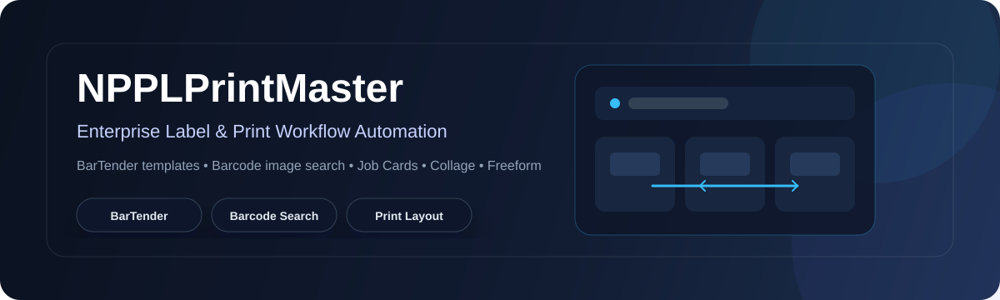
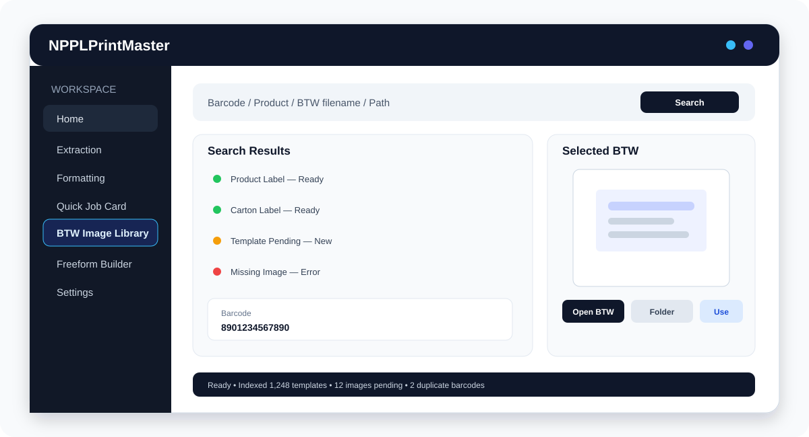
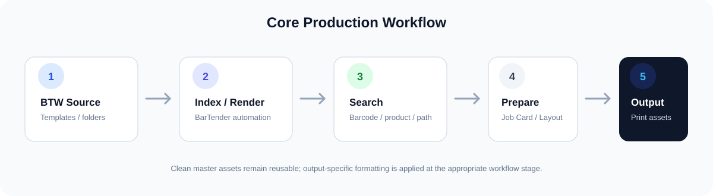

<div align="center">



<p>
  <a href="#about-the-project">About</a> ·
  <a href="#features">Features</a> ·
  <a href="#ui--ux">UI / UX</a> ·
  <a href="#workflow">Workflow</a> ·
  <a href="#technology">Technology</a> ·
  <a href="#getting-started">Getting Started</a> ·
  <a href="#license">License</a>
</p>

<p>
  
  
  
  
  
</p>

</div>

---

## About the Project

**NPPLPrintMaster** is a Windows desktop application created to reduce repetitive work around **BarTender `.BTW` templates**, label images, barcode-based image lookup, Job Cards, collage layouts, and Freeform print preparation.

The software is intended for a practical manufacturing workflow where label assets move through preparation, search, review, layout, and downstream document processes.

### The core objective

> **Automate repetitive label-preparation work while protecting original BTW templates and keeping generated print assets organised, searchable, and reusable.**

NPPLPrintMaster prepares local files and assets used in the SAP DMS workflow. The current documented workflow does **not** claim direct SAP document-upload integration.

---

## Features

### BarTender Image Extraction

Generate image files from BarTender `.BTW` templates through the BarTender automation workflow.

- Single-template extraction
- Batch extraction
- Recursive folder processing
- Configurable DPI
- PNG, BMP, JPG/JPEG, and TIFF output
- Configurable output folders
- Optional source-folder preservation
- Combined extraction and formatting workflows

### Find & Extract BTW Files

Search a master BTW directory without manually browsing through large folder structures.

- Exact filename matching
- Case-insensitive matching
- Optional `.btw` extension in search input
- Multiple template names
- TXT input lists
- Excel input lists
- Duplicate filename results
- Recursive folder search
- Extraction of matched templates

### Image Formatting

Prepare generated images for downstream workflows.

- Border width
- Border colour
- Padding
- Output format
- Recursive processing
- Source-folder preservation
- Output directory selection

### Quick Job Card

Prepare product and carton imagery for Job Card workflows.

- Product lane
- Carton lane
- Image selection
- Preview
- Job Card generation
- Freeform customization hand-off

### Smart Image Finder

Fast barcode-based local image lookup designed for USB barcode scanners.

- Product image search
- Carton image search
- Search while typing or scanning
- Exact barcode lookup
- Duplicate/version results
- Newest modified result first
- Large image inspection
- Product and Carton lanes
- Incremental index refresh
- Optional folder monitoring
- Failed barcode/file inspection
- Persistent local index/cache behaviour

### BTW Image Library

A searchable local repository for BTW templates and their generated clean image masters.

Processing is deliberately separated into three manual stages:

```text
Configured Folders
      │
      ▼
  1. Index BTW
      │
      ▼
2. Create Images
      │
      ▼
3. Index Barcodes
      │
      ▼
    SQLite
```

Features include:

- Include / exclude folders
- Recursive BTW indexing
- Clean image generation
- Barcode indexing
- SQLite persistence
- Duplicate barcode detection
- Status tracking
- Search by barcode
- Search by product
- Search by BTW filename
- Search by BTW path
- Large image preview
- Open BTW
- Open folder
- Copy path
- Use Image

### Image Collage Builder

A visual workspace for arranging image assets into print-oriented layouts.

- Grid layouts
- Automatic arrangement
- Manual arrangement
- Multiple pages
- Page orientation
- Captions / filenames
- Grid-cell borders
- Drag and drop
- Selection
- Zoom and pan
- Undo and redo
- Custom captions
- PDF-oriented output workflow

### Pro Freeform Builder

A large visual composition workspace for custom print layouts.

- Image placement
- Move and resize
- Rotation
- Text objects
- Text formatting
- Reusable elements
- Quick text
- Workspace save/load
- Undo
- Image duplication
- Final BMP export
- Output information
- Physical-size reference calculations

### A4 Print Reference

A separate visual reference feature for the Freeform Builder.

- A4 portrait reference
- 210 × 297 mm
- 300 DPI reference
- Artwork visible outside A4
- Overflow indication
- Printable-area reference
- Margin reference
- Position reference
- Final export-boundary reference

---

## UI / UX

NPPLPrintMaster is designed as a **production-oriented desktop application** rather than a generic image editor.

The interface follows the operator's natural workflow:

**Select → Search → Preview → Prepare → Arrange → Verify → Export**



### Application shell

```text
┌────────────────────────────────────────────────────────────────────────────┐
│ NPPLPrintMaster                                             Search / Help  │
├───────────────────┬────────────────────────────────────────────────────────┤
│                   │                                                        │
│  Home             │                    Active Workspace                    │
│  Extraction       │                                                        │
│  Formatting       │       Search / Preview / Work / Export                │
│  Quick Job Card   │                                                        │
│  BTW Image Library│                                                        │
│  Freeform Builder │                                                        │
│  Settings         │                                                        │
│                   │                                                        │
├───────────────────┴────────────────────────────────────────────────────────┤
│ Status • Progress • Result • Message                                     │
└────────────────────────────────────────────────────────────────────────────┘
```

### Visual design principles

| Principle | Purpose |
|---|---|
| Task-first | Keep the primary operation immediately visible |
| Preview-first | Let the operator inspect assets before using/exporting them |
| Scanner-friendly | Minimise mouse interaction during barcode workflows |
| Clear status | Make processing state obvious without opening diagnostics |
| Information density | Show useful production information without visual clutter |
| Source safety | Keep the distinction between master templates and generated outputs clear |
| Consistency | Reuse the same interaction patterns across modules |

### BTW Image Library

The library uses a **search + results + selected preview** layout:

```text
Search
  ↓
Results
  ↓
Selected BTW
  ↓
Clean Preview
  ↓
Open / Copy / Use
```

### Smart Image Finder

The finder is designed around:

```text
Scan
  ↓
Instant Search
  ↓
Matching Image
  ↓
Preview
  ↓
Select
```

### Image Collage Builder

The collage workspace prioritises direct visual arrangement:

```text
Source Images → Page → Arrange → Preview → Output
```

### Freeform Builder

The Freeform Builder separates the large working canvas from the final export reference:

```text
Workbench
    ↓
Objects / Text / Position
    ↓
Export Page
    ↓
Final BMP
```

The A4 reference feature is kept separate so that print-reference functionality does not require replacing the established Freeform Builder.

---

## Workflow



### BTW template to searchable asset

```text
BarTender BTW Template
          │
          ▼
       Index
          │
          ▼
   Create Clean Image
          │
          ▼
    Index Barcode
          │
          ▼
       SQLite
          │
          ▼
    Search / Scan
          │
          ▼
  Preview / Open / Use
```

### Barcode to Job Card

```text
USB Barcode Scanner
         │
         ▼
   Barcode Search
         │
         ▼
Product / Carton Match
         │
         ▼
      Preview
         │
         ▼
    Quick Job Card
         │
         ▼
Customize / Save
```

### Image to Freeform output

```text
Clean Image
     │
     ▼
Freeform Builder
     │
     ├── Move
     ├── Resize
     ├── Rotate
     └── Add Text
     │
     ▼
Final BMP Export
```

---

## Technology

| Area | Technology |
|---|---|
| Platform | Microsoft Windows |
| Language | C# |
| Framework | .NET Framework 4.7.2 |
| UI | Windows Forms |
| Label automation | BarTender Automation |
| Database | SQLite |
| Barcode processing | ZXing.Net |

### Main source components

| Component | Source |
|---|---|
| Main application | `Form1.cs` and partial modules |
| BarTender automation | `BarTenderEngine.cs` |
| BTW Image Library | `BtwImageLibraryEngine.cs` |
| BTW Library UI | `Form1.BtwLibrary.cs` |
| BTW list processing | `BtwListReader.cs` |
| Image formatting | `FormatEngine.cs` |
| Smart Image Finder | `SmartImageFinderEngine.cs` |
| Smart Finder UI | `Form1.SmartFinder.cs` |
| Collage | `ImageCollageEngine.cs` |
| Collage UI | `CollageArrangementForm.cs` |
| Freeform Builder | `FreeformBuilderForm.cs` |
| Freeform items | `CanvasItem.cs` |
| A4 reference | `FreeformA4PreviewFeature.cs` |
| Workspace handling | `WorkspaceEngine.cs` |
| Settings | `SettingsManager.cs` |
| Theme management | `ThemeManager.cs` |
| Appearance | `AppearanceManager.cs` |

---

## System Requirements

| Requirement | Details |
|---|---|
| Operating system | Microsoft Windows |
| Framework | .NET Framework 4.7.2 |
| BarTender | Installed and properly licensed |
| File access | Read/write access to configured source and output folders |
| Barcode scanner | USB keyboard-emulation scanner for scanner workflows |
| SAP DMS | Used by the downstream document workflow |

---

## Getting Started

### 1. Clone

```bash
git clone https://github.com/yateshr/NPPLPrintMaster.git
cd NPPLPrintMaster
```

### 2. Open

Open the solution in **Visual Studio**.

### 3. Restore dependencies

Restore the project's NuGet/package dependencies.

### 4. Build

```text
Build → Rebuild Solution
```

The project targets **.NET Framework 4.7.2**.

### 5. Run

Start the application using the selected Visual Studio build configuration.

---

## Project Structure

```text
NPPLPrintMaster
│
├── Dashboard Home
│
├── Extraction
│   ├── BarTender Image Extraction
│   └── Find & Extract BTW Files
│
├── Formatting
│   ├── Image Formatting
│   └── Image Collage Builder
│
├── Quick Job Card
│   └── Smart Image Finder
│
├── BTW Image Library
│   ├── BTW Index
│   ├── Image Generation
│   ├── Barcode Index
│   └── Search / Preview / Actions
│
├── Pro Freeform Builder
│   ├── Design Workspace
│   ├── Images
│   ├── Text
│   └── Export
│
└── Settings
```

---

## Important Project Rules

### Original BTW templates remain protected

The original `.BTW` files are source/master assets.

```text
BTW Source
   │
   ├── Read
   ├── Index
   └── Render
        │
        ▼
Generated Clean Image
```

Normal extraction and BTW Image Library processing should not modify or save changes to the original master template.

### BarTender COM processing

The BTW Image Library image-generation stage is designed around **one BarTender COM application instance** and sequential BTW rendering.

### Clean master images

BTW Image Library master images are intended to remain clean and borderless.

Output-specific formatting should be applied at the appropriate usage/output stage.

### Preserve stable functionality

Working modules such as the BarTender workflow and Image Collage Builder should not be altered as a side effect of unrelated feature development.

---

## Documentation

Detailed project documentation is maintained in the repository:

End-user documentation includes:

- `faq.md`
- `troubleshooting.md`
- `requirements.md`
- `releasenotes.md`
- `about.md`
- `license.md`

---

## Project Evolution

```text
Manual Label Preparation
          │
          ▼
CMD / PowerShell Automation
          │
          ▼
Windows Desktop Application
          │
          ├── BarTender Extraction
          ├── Formatting
          ├── Job Card Workflow
          ├── Smart Image Finder
          ├── Image Collage Builder
          ├── BTW Image Library
          └── Pro Freeform Builder
```

The project evolved around practical manufacturing label and print requirements rather than as a general-purpose image editor.

---

## Issue Reporting

When reporting an issue, include:

```text
Application version:
Windows version:
Visual Studio/build configuration:
BarTender version:
Module:
Exact error:
Steps to reproduce:
Expected behaviour:
Actual behaviour:
Relevant files/logs:
```

For barcode or image-generation problems, also include:

- Input template/image type
- DPI
- Output format
- Whether the problem is reproducible
- Whether the original BTW template works correctly in BarTender

---

## License

**NPPLPrintMaster is proprietary software.**

The project's license documentation identifies the software, source code, architecture, workflow design, UI designs, graphics, and related materials as protected intellectual property of **Yatesh Rohit**.

Unless separately authorised in writing, the license documentation restricts activities including:

- Redistribution
- Copying or distributing source code
- Reverse engineering or decompilation
- Removing or altering copyright notices
- Resale or sublicensing
- Incorporation into other products

See [`license.md`](license.md) for complete license terms.

> Public GitHub visibility does not by itself make NPPLPrintMaster open-source software.

---

## Author

**Yatesh Rohit**  
IT Department  
**Nirmal Poly Plast Pvt. Ltd.**

Copyright © 2026 Yatesh Rohit. All Rights Reserved.

---

## Acknowledgements

The project documentation acknowledges technical references and learning resources from:

- Microsoft .NET documentation
- BarTender / Seagull Scientific documentation
- GitHub Community
- Google Gemini AI
- Claude Code
- Codex AI
- Other technical references used during development

---

<div align="center">

**NPPLPrintMaster**

*Label automation, image management, and print workflow preparation in one Windows application.*

</div>
